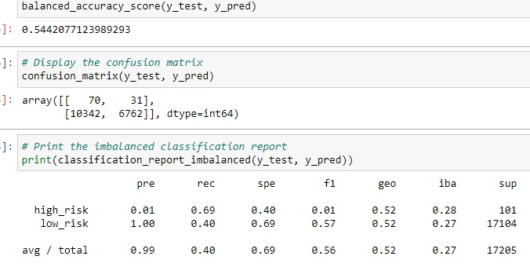

# Credit_Risk_Analysis
## Overview
Here, we run and evaluate several machine learning algorithms, including:
- Random Oversampler
- SMOTE
- Cluster Centroids
- SMOTEENN
- Balanced Random Forest Classifier
- and Easy Ensemble Classifier.

We feed loan data into these to determine if any are effective models for predicting credit risk.
## Results
### Naive Random Oversampler

- Balanced accuracy score:  0.69
- Precision score(avg.):    0.99
- Recall score(avg.):       0.60

### SMOTE

- Balanced accuracy score:  0.66
- Precision score(avg.):    0.99
- Recall score(avg.):       0.69  

### Cluster Centroids

- Balanced accuracy score:  0.54
- Precision score(avg.):    0.99
- Recall score(avg.):       0.40

### SMOTEENN

- Balanced accuracy score:  0.68
- Precision score(avg.):    0.99
- Recall score(avg.):       0.58

### Balanced Random Forest Classifier

- Balanced accuracy score:  0.79
- Precision score(avg.):    0.99
- Recall score(avg.):       0.87

### Easy Ensemble Classifier

- Balanced accuracy score:  0.93
- Precision score(avg.):    0.99
- Recall score(avg.):       0.94

## Summary
Each model and algorithm trained here performed very well when evaluating low-risk loans.  However, all perform very poorly with the smaller high-risk group, none receiving more than 0.1 with precision.  This means a lot of false positives for high-risk loans; in other words, the models seem to err heavily on the side of predicting "high-risk."

For bank loans, it is more dangerous to agree to high-risk loans while incorrectly assuming they are low-risk, ie. false negatives.  This would mean more money leant, more defaulting payments, and larger losses of money.  False positives mean missing out on opportunities to accrue interest.  However, with such dismal numbers, I would not recommend using any of these models.  If one must be used, the easy ensemble classifier is the easy answer, with an accurracy over 90% and a 9% high-risk precision.
